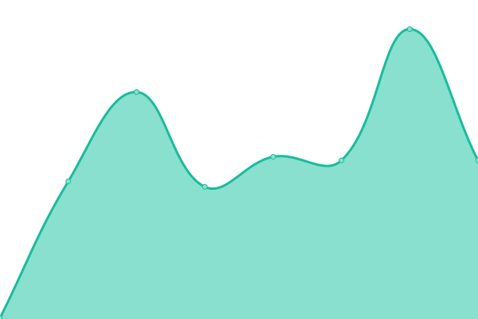

# [📈 Live Status](https://uptime.signalwerk.ch): <!--live status--> **🟧 Partial outage**

This repository contains the open-source uptime monitor and status page for [Upptime](https://upptime.js.org), powered by [Upptime](https://github.com/upptime/upptime).

With [Upptime](https://upptime.js.org), you can get your own unlimited and free uptime monitor and status page, powered entirely by a GitHub repository. We use [Issues](https://github.com/upptime/upptime/issues) as incident reports, [Actions](https://github.com/signalwerk/upptime/actions) as uptime monitors, and [Pages](https://uptime.signalwerk.ch) for the status page.

<!--start: status pages-->
<!-- This summary is generated by Upptime (https://github.com/upptime/upptime) -->
<!-- Do not edit this manually, your changes will be overwritten -->
<!-- prettier-ignore -->
| URL | Status | History | Response Time | Uptime |
| --- | ------ | ------- | ------------- | ------ |
|  [sfgz](https://sfgz.ch/) | 🟩 Up | [sfgz.yml](https://github.com/signalwerk/uptime/commits/HEAD/history/sfgz.yml) | 

 769ms
     
 | 

<a href="https://uptime.signalwerk.ch/history/sfgz">100.00%</a>
    

|  [signalwerk – main](https://signalwerk.ch/) | 🟩 Up | [signalwerk-main.yml](https://github.com/signalwerk/uptime/commits/HEAD/history/signalwerk-main.yml) | 

 165ms
     
 | 

<a href="https://uptime.signalwerk.ch/history/signalwerk-main">0.02%</a>
    

|  [Beda Greenwood](https://bedagreenwood.com/) | 🟩 Up | [beda-greenwood.yml](https://github.com/signalwerk/uptime/commits/HEAD/history/beda-greenwood.yml) | 

 691ms
     
 | 

<a href="https://uptime.signalwerk.ch/history/beda-greenwood">100.00%</a>
    

|  [Veso](https://www.veso.ch/) | 🟩 Up | [veso.yml](https://github.com/signalwerk/uptime/commits/HEAD/history/veso.yml) | 

 1286ms
     
 | 

<a href="https://uptime.signalwerk.ch/history/veso">100.00%</a>
    

|  [Höllgrotten](https://www.hoellgrotten.ch/) | 🟩 Up | [hoellgrotten.yml](https://github.com/signalwerk/uptime/commits/HEAD/history/hoellgrotten.yml) | 

 1186ms
     
 | 

<a href="https://uptime.signalwerk.ch/history/hoellgrotten">100.00%</a>
    

|  [Webhook Test for Uptime](https://webhook-uptime.signalwerk.workers.dev/test) | 🟥 Down | [webhook-test-for-uptime.yml](https://github.com/signalwerk/uptime/commits/HEAD/history/webhook-test-for-uptime.yml) | 

 202ms
     
 | 

<a href="https://uptime.signalwerk.ch/history/webhook-test-for-uptime">100.00%</a>
    

<!--end: status pages-->

[**Visit our status website →**](https://uptime.signalwerk.ch)

## 📄 License

- Powered by: [Upptime](https://github.com/upptime/upptime)
- Code: [MIT](./LICENSE) © [Upptime](https://upptime.js.org)
- Data in the `./history` directory: [Open Database License](https://opendatacommons.org/licenses/odbl/1-0/)
